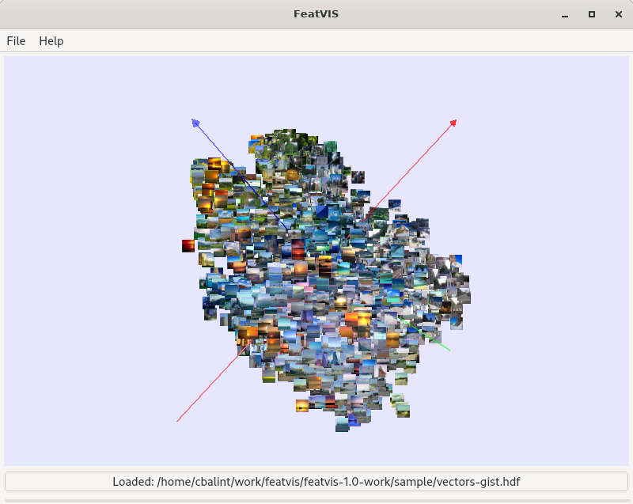

FeatVIS: **Feat**ures **VIS**ualiziation

### Description

FeatVIS helps visualize multidimensional features space.

## Specs

Currently implements:

 * GIST (fourier domain) descriptors for images
 * FLANN for clustering and nearest neighbouring
 * BH-TSNE (Barnes-Hut) or MDS (eigen based) for embedding

